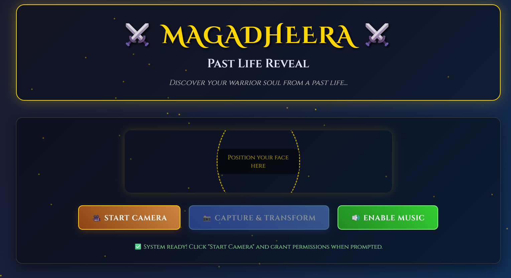
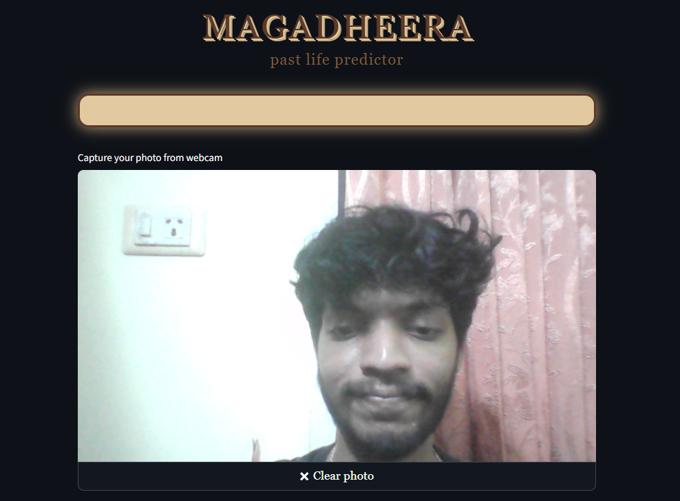
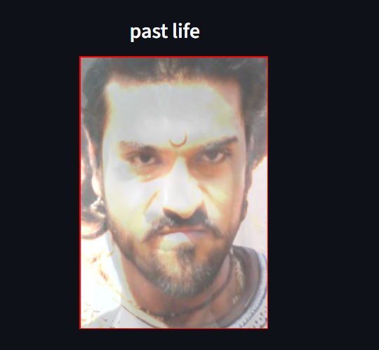

# Magadheera Past Life Reveal 🎯

Project URL:
https://face-morpher-jaj62eu9mduavcphlag6ke.streamlit.app/

## Basic Details
### Team Name: Cinematic Coders

### Team Members
- Deva Nanda Nair - Toc H Institute of Science and Technology
- Abel Kurain - Toc H Institute of Science and Technology

### Project Description
Magadheera Past Life Reveal is a fun browser-based app that uses your webcam to detect your face, replace it with a Magadheera character to reveal “who you were” in a past life, and add your “past lover” beside you — all while the iconic Magadheera title track plays.

### The Problem (that doesn't exist)
People are living their lives without knowing their true past-life Magadheera identity.  
How can one make important life choices without this crucial information?

### The Solution (that nobody asked for)
By blending computer vision with cinematic flair, our app instantly uncovers your Magadheera alter ego and past lover — because everyone deserves to know if they were a sword-wielding warrior in a previous birth.

---

## Technical Details
### Technologies/Components Used
- **Languages:** HTML, CSS, JavaScript
- **Frameworks:** None (pure browser app)
- **Libraries:** [face-api.js](https://justadudewhohacks.github.io/face-api.js/), getUserMedia API
- **Tools:** Vercel (hosting), VS Code

#### Installation
No installation required. Just clone the repo:

git clone https://github.com/devananda6200/Useless-MagaDheera

## Team Contributions
- Deva Nanda Nair: Hosting and Frontend
- Abel Kurian : Camera controls

---
Made with ❤️ at TinkerHub Useless Projects 

